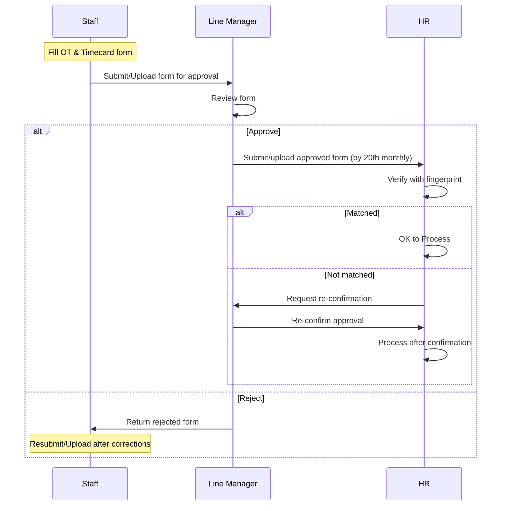

# 📌 Detailed Requirement Breakdown
## Customer: MEC

### Feature 1: Payroll Processing
**Description**: Process payroll once per month, including base salary and verified OT.  
- [ ] Define payroll cycle (cut-off on 20th, HR submission by 21st)  
- [ ] Compile salary + OT data from figner print system  
- [ ] Exclude back office clock-in/out from payroll calculation (for now)  
- [ ] Generate final payroll report and payslips  

---

### Feature 2: Overtime (OT) Management
**Description**: Allow OT to be claimed, tracked, and verified by project.  
- [ ] Support multiple OT types:  
  - Normal ×1  
  - Public Holiday ×1.5  
- [ ] Enable OT claim import via Excel (using standard template)  
- [ ] Record OT by project code/name (multi-project allowed per employee)  
- [ ] Capture OT details: start–end time, hours, type  
- [ ] HR verifies OT claims; key users can adjust/correct  
- [ ] (Future) Add manager approval workflow before HR verification  

---

### Feature 3: Timecard Management
**Description**: Collect employee attendance data and integrate into payroll.  
- [ ] Import timecard data into HR System via Excel template  
- [ ] Verify imported data against hard copy (by HR)  
- [ ] Allow key users (HR/Admin) to adjust incorrect records  
- [ ] Define cut-off rule: timecard data closes every 20th of month  

---

### Feature 4: Klock In/Out Tracking
**Description**: Track attendance using fingerprint machines, starting with back office.  
- [ ] Enable back office staff to clock in/out (not yet linked to payroll)  
- [ ] Configure site-level fingerprint machines for onsite projects  
- [ ] Support multiple working hours by project (7–4, 7–5)  
- [ ] Handle sites without fingerprint machine via manual timecard  

---

### Feature 5: Working Schedule Configuration
**Description**: Define and manage different working schedules across teams.  
- [ ] Back office = 5.5 days/week (Sat half-day)  
- [ ] Onsite staff = 6 days/week (Sat full-day)  
- [ ] Apply project-specific start/end times  

---

### Feature 6: HR Verification & Adjustment
**Description**: HR ensures payroll and OT data is accurate before processing.  
- [ ] HR cross-checks timecards with hard copy submissions  
- [ ] HR verifies OT claims per project  
- [ ] HR adjusts data if mismatches are found  
- [ ] Provide audit log of adjustments for transparency  

---

### Feature 7: Future Enhancements
**Description**: Extend system functionality to reduce manual work.  
- [ ] Add OT approval workflow (Manager → HR)  
- [ ] Automate payroll calculation directly from system  
- [ ] Standardize fingerprint machine integration across all projects  

## Cost Breakdown

### Development Costs

|No.| Item | Rate | Duration | Total | Note |
|-|------|------|----------|-------|------|
|1| SOENG Kanel| $xxxx/month | 1 months | $x,xxx| Backend/API |
|2| CHUNG Kuch Chhay | $xxx/month | 3 months | $2000| Fullstack |
|3| ORM Bonna | $xxx/month | 3 months | $xxx| Frontend |
|4| **Development Total** | | | **$x,000** |

### Infrastructure Costs

| Item | Cost | Duration | Total |
|------|------|----------|-------|
| **Option 1: DP VPS** (Recommended) | | | |
| LEADER VPS (Production) | $16.78/month | monthly | $201.36/year |
| | | | |

## 11. MEC's Overtime & Timecard Approval Workflow

