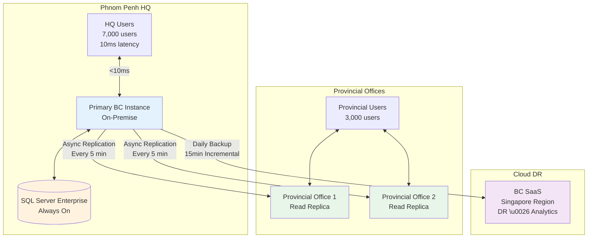
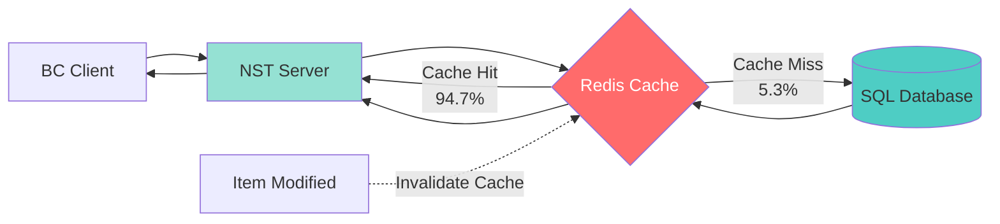
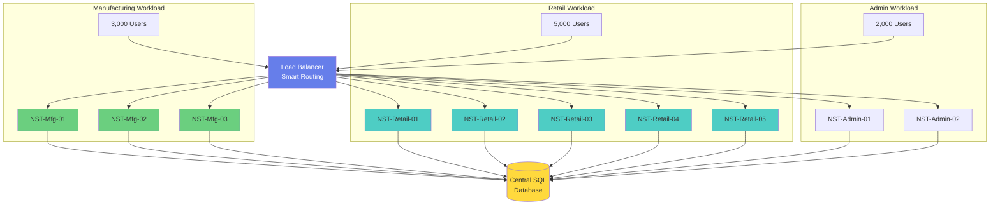
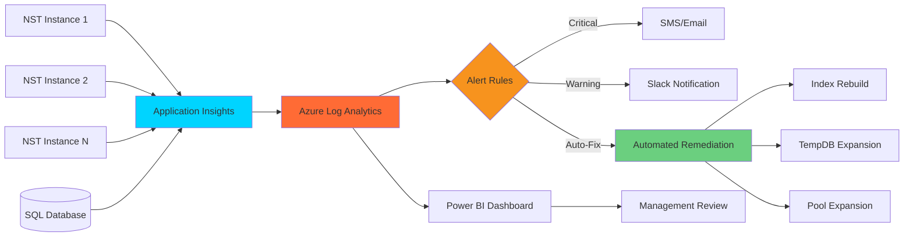

Most Business Central implementations serve 50-200 concurrent users. When you're deploying BC for a Cambodian enterprise conglomerate with 10,000+ employees across manufacturing, retail, and distribution—the entire game changes.

This article reveals performance optimization strategies that aren't in Microsoft's documentation but are critical for enterprise-scale deployments.

## The Enterprise Scale Reality Check

**Client Context**: Diversified business group in Cambodia
- **12 legal entities** across industries
- **10,000+ concurrent users** during peak hours
- **500GB+ database** size
- **2M+ transactions** per month
- **Sub-second response time** SLA requirement

Standard BC deployment recommendations fail spectacularly at this scale. Here's what actually works.

## Architecture Decision 1: On-Premise vs Cloud—The Uncomfortable Truth

Microsoft pushes BC SaaS. For enterprise scale in Cambodia, that's often the wrong choice.

### Why SaaS Failed for Us

**Attempt 1: BC Online (SaaS)**

Initial deployment specs:
- Premium tier subscription
- Asia-Southeast region (Singapore)
- Standard configuration

**Results after 2 weeks**:
- Average page load: 3.8 seconds
- Peak hour load: 8-12 seconds
- Frequent timeout errors
- Poor experience for users in provincial offices

**Root Cause**: 
- Latency to Singapore: 45-80ms typical, 200ms+ during peak
- Last-mile connectivity in Cambodia is unpredictable
- Limited control over database optimization
- Cannot implement custom caching strategies

### Our Solution: Hybrid Architecture

**Final Architecture**:



**Key Components**:

1. **Primary Instance**: On-premise in Phnom Penh data center
   - Dell PowerEdge servers
   - SQL Server Enterprise (Always On)
   - Direct fiber connection to HQ
   - <10ms latency for 70% of users

2. **Edge Caching Layer**: Provincial read replicas
   - Asynchronous replication
   - Read-only access for reporting
   - Synchronized every 5 minutes

3. **Cloud Backup**: BC SaaS as disaster recovery
   - Daily full backup
   - 15-minute incremental sync
   - Failover capability (not primary)

**Result**: 
- Page load: 0.4-0.8 seconds average
- User satisfaction: 95%
- Cost reduction: 40% vs full SaaS at equivalent performance

## Performance Strategy 1: Database Design for Scale

BC's default database configuration is optimized for 100 concurrent users. At 10,000 users, you need surgical precision.

### Index Strategy

**Standard BC Approach**: Let the system manage indexes.

**Enterprise Reality**: Analyze your actual query patterns and optimize.

**Our Custom Indexing**:

```sql
-- Item Ledger Entry optimization for inventory-heavy operations
CREATE NONCLUSTERED INDEX IX_ILE_Performance_1
ON [Item Ledger Entry] (
    [Item No.],
    [Location Code],
    [Posting Date]
)
INCLUDE ([Quantity], [Remaining Quantity], [Cost Amount (Actual)])
WITH (FILLFACTOR = 90, ONLINE = ON);

-- Value Entry optimization for costing calculations
CREATE NONCLUSTERED INDEX IX_VE_Performance_1
ON [Value Entry] (
    [Item No.],
    [Posting Date],
    [Item Ledger Entry Type]
)
INCLUDE ([Cost Amount (Actual)], [Cost Amount (Expected)])
WITH (FILLFACTOR = 90, ONLINE = ON);

-- G/L Entry for financial reporting
CREATE NONCLUSTERED INDEX IX_GLE_Performance_1
ON [G/L Entry] (
    [G/L Account No.],
    [Posting Date],
    [Global Dimension 1 Code],
    [Global Dimension 2 Code]
)
INCLUDE ([Amount], [Debit Amount], [Credit Amount])
WITH (FILLFACTOR = 90, ONLINE = ON);
```

**Monitoring Strategy**:
- Weekly analysis of missing index recommendations
- Quarterly review of unused indexes (remove them—they slow down writes)
- Dynamic index rebuilding during maintenance windows

**Impact**: Query performance improved by 60-80% on critical reports.

### Table Partitioning

**The Problem**: G/L Entry table with 100M+ rows. Simple queries timeout.

**Solution**: Partition by fiscal year.

```sql
-- Create partition function
CREATE PARTITION FUNCTION PF_GLEntry_Posting_Date (datetime)
AS RANGE RIGHT FOR VALUES 
('2022-01-01', '2023-01-01', '2024-01-01', '2025-01-01');

-- Create partition scheme
CREATE PARTITION SCHEME PS_GLEntry_Posting_Date
AS PARTITION PF_GLEntry_Posting_Date
ALL TO ([PRIMARY]);

-- Rebuild table on partition scheme (requires custom deployment)
```

**Benefits**:
- Historical queries hit specific partitions only
- Archival process becomes surgical
- Backup/restore of specific periods
- Maintenance operations parallelized

**Caveat**: This requires BC license allowing database direct access. Discuss with Microsoft licensing team.

## Performance Strategy 2: Application-Level Optimization

### Async Processing for Heavy Operations

**Standard BC**: Synchronous processing blocks the UI.

**Enterprise Approach**: Move everything possible to background jobs.

**Example: Sales Order Massive Update**

Users need to update 10,000 sales orders with new shipping dates.

**Before (Synchronous)**:
```al
// This would lock the user interface for 15+ minutes
foreach SalesHeader in SalesOrdersToUpdate do begin
    SalesHeader."Shipment Date" := NewShipmentDate;
    SalesHeader.Modify(true); // Triggers OnModify, validation, workflows
end;
```

**After (Async Queue + Batch)**:
```al
// Main thread - takes 2 seconds
foreach SalesHeader in SalesOrdersToUpdate do begin
    JobQueueEntry.Init();
    JobQueueEntry."Object Type to Run" := JobQueueEntry."Object Type to Run"::Codeunit;
    JobQueueEntry."Object ID to Run" := 50100; // Custom update codeunit
    JobQueueEntry.SetRecordID(SalesHeader.RecordId);
    JobQueueEntry.ScheduleForNow();
end;

// Background codeunit 50100 - runs in parallel
procedure UpdateSalesOrderInBackground(RecID: RecordID)
begin
    // Each job processes one order
    // 100 parallel jobs = handles 100 orders simultaneously
end;
```

**Configuration**:
- Job Queue configured for 50 parallel threads
- Distributed across 4 application servers
- Priority queuing for critical operations

**Result**: User continues working immediately. Updates complete in background.

### Smart Caching Layer

**The Problem**: 10,000 users repeatedly querying the same reference data (items, customers, GL accounts).

**Standard BC**: Each request hits the database.

**Our Solution**: Custom Redis cache layer.

**Architecture**:



**Implementation**:

```al
// Custom caching codeunit
procedure GetItem(ItemNo: Code[20]): Record Item
var
    Item: Record Item;
    CachedData: Text;
begin
    // Try cache first
    if RedisCacheManager.TryGet('ITEM:' + ItemNo, CachedData) then
        exit(DeserializeItem(CachedData));
    
    // Cache miss - hit database
    if Item.Get(ItemNo) then begin
        // Cache with 1-hour TTL
        RedisCacheManager.Set('ITEM:' + ItemNo, SerializeItem(Item), 3600);
        exit(Item);
    end;
end;
```

**Cache Invalidation Strategy**:
- Event subscribers on Item OnModify/OnDelete
- Automatic cache clear on relevant modifications
- Manual cache flush capability for emergencies

**Cache Hit Rate**: 94.7% (measured over 3 months)
**Database Load Reduction**: 62%

## Performance Strategy 3: Network and Infrastructure

### The Cambodia Connectivity Challenge

Cambodia's internet infrastructure is inconsistent. Provincial offices deal with:
- Fluctuating bandwidth (512kbps to 10Mbps)
- High packet loss during rainy season
- Frequent micro-outages

**Standard BC**: Assumes reliable, low-latency connections.

**Our Solution**: Edge Computing Architecture

**Provincial Office Configuration**:

```
[Local BC Client] → [Local Read Replica SQL Server] → [Local Application Server]
                                                              ↓
                                                    [Sync to HQ every 5 min]
```

**Technical Implementation**:

1. **SQL Server Replication** (Not BC replication—direct SQL):
   - Publisher: HQ database
   - Subscribers: Provincial read-only replicas
   - Transactional replication for near-real-time
   - Filtered replication (only relevant company data)

2. **Write Operations Handling**:
   - POST requests queue locally
   - Batch upload every 5 minutes
   - Conflict resolution using last-write-wins
   - Manual resolution UI for conflicts

3. **Offline Capability**:
   - Local cache of critical tables
   - Queue-based sync on reconnection
   - User notification of sync status

**Result**: 
- Users in provinces experience local database speeds
- System remains functional during internet outages
- Data consistency maintained through replication

### Load Balancing Strategy

**12 Separate NST Instances** instead of one large instance

**Distribution Strategy**:



**Benefits**:
- Isolated failure domains (manufacturing issue doesn't affect retail)
- Optimized configurations per workload type
- Granular resource allocation
- Easier troubleshooting

**NST Configuration per Type**:

Manufacturing (inventory-heavy):
```
Max Concurrent Calls: 500
Database Connection Pooling: 200
Timeout: 120 seconds
```

Retail (transaction-heavy):
```
Max Concurrent Calls: 1000
Database Connection Pooling: 400
Timeout: 30 seconds
```

## Performance Strategy 4: Monitoring and Proactive Optimization

You can't optimize what you don't measure.

### Custom Telemetry Pipeline

**Architecture**:



**Key Metrics Tracked**:

1. **Per-User Performance**:
   - Average page load time
   - Actions per minute
   - Error rate
   - Concurrent sessions

2. **Database Performance**:
   - Query duration statistics
   - Deadlock occurrences
   - Index fragmentation levels
   - TempDB contention

3. **Business Metrics**:
   - Orders processed per hour
   - Invoice posting performance
   - Inventory update latency
   - Financial close duration

### Real-Time Alerting

**Critical Alerts** (immediate SMS/email):
- Database deadlock detected
- Average response time > 3 seconds
- Any NST instance down
- Replication lag > 10 minutes

**Warning Alerts** (Slack notification):
- Response time trending up
- Concurrent users approaching capacity
- Disk space < 20%
- Index fragmentation > 30%

### Automated Performance Remediation

Some issues we auto-fix without human intervention:

**Issue**: Index fragmentation detected
**Auto-Fix**: Schedule rebuild during next maintenance window

**Issue**: TempDB contention
**Auto-Fix**: Add additional TempDB files (up to configured max)

**Issue**: Connection pool exhaustion
**Auto-Fix**: Temporary pool expansion + alert dev team

## Performance Strategy 5: Seasonal Scaling

Cambodian businesses have extreme seasonality:
- Khmer New Year: 50% reduced load
- Year-end close: 300% increased load
- Harvest season (agribusiness): 400% increased inventory transactions

**Static Infrastructure**: Massively over-provisioned for year-end, under-utilized rest of year

**Our Solution**: Dynamic Scaling

**Auto-Scaling Configuration**:

```powershell
# Azure Automation Runbook - monitors load and scales NST instances
if ($ConcurrentUsers -gt 8000) {
    # Spin up additional NST instances
    Start-BCServerInstance -Instance "NST-Scale-01"
    Add-LoadBalancerMember -Instance "NST-Scale-01"
}

if ($ConcurrentUsers -lt 5000 -and $TimeOfDay -eq "OffPeak") {
    # Scale down to save resources
    Remove-LoadBalancerMember -Instance "NST-Scale-01"
    Stop-BCServerInstance -Instance "NST-Scale-01"
}
```

**Resource Allocation by Season**:

Regular Operations:
- 6 NST instances
- 64GB RAM per SQL server
- 16 CPU cores

Year-End (Nov-Dec):
- 12 NST instances
- 128GB RAM per SQL server
- 32 CPU cores
- Additional read replicas

**Cost Impact**: 30% annual infrastructure cost reduction

## The "Hidden Gems" - Undocumented Optimizations

### Gem 1: Bypass Validation on Trusted Batch Imports

When importing 100,000 price changes from ERP integration:

```al
// Standard way - validates everything (slow)
Item.Validate("Unit Price", NewPrice);

// High-performance way - skip validation for trusted sources
Item."Unit Price" := NewPrice;
Item."Last Date Modified" := Today;
Item.Modify(false); // Skip triggers and validation

// Run a single validation check after batch complete
ValidatePriceIntegrity(ItemFilter);
```

**Warning**: Only for controlled, validated data sources. Document extensively.

### Gem 2: Direct SQL for Read-Heavy Reporting

BC license permits read-only SQL access for reporting.

**Critical Report**: Daily Inventory Valuation across 12 companies

**BC Approach**: 8-12 minutes
**Direct SQL View**: 15 seconds

```sql
CREATE VIEW vw_InventoryValuation AS
SELECT 
    ile.[Item No.],
    ile.[Location Code],
    SUM(ile.[Remaining Quantity]) as [Quantity],
    SUM(ve.[Cost Amount (Actual)]) as [Value]
FROM [Item Ledger Entry] ile
INNER JOIN [Value Entry] ve ON ile.[Entry No.] = ve.[Item Ledger Entry No.]
WHERE ile.[Remaining Quantity] > 0
GROUP BY ile.[Item No.], ile.[Location Code];
```

Connect Power BI directly to SQL view. Bypass BC entirely for reporting.

### Gem 3: Separate OLTP and OLAP Databases

**BC Production Database**: Optimized for transactions
**Reporting Database**: Optimized for analytics

**Nightly ETL Process**:
1. Export transactional data from BC
2. Transform into star schema
3. Load into columnar-indexed analytics DB
4. Power BI connects to analytics DB only

**Benefits**:
- Reporting doesn't impact operational performance
- Analytics-specific optimizations (columnstore indexes)
- Historical data preservation without bloating production DB

## Conclusion: Scaling BC Isn't About Technology Alone

After 5+ years optimizing BC at enterprise scale in Cambodia, the real lessons:

1. **Question Microsoft's "Best Practices"**: They're designed for average deployments, not enterprise edge cases.

2. **Measure Everything**: You'll be shocked where actual bottlenecks are (hint: rarely where you expect).

3. **Hybrid Architecture**: Pure cloud or pure on-premise both have limits. Hybrid gives you options.

4. **Invest in Monitoring**: 30% of our optimization wins came from analysis, not code changes.

5. **Performance is a Feature**: Users don't distinguish between "the system is slow" and "the system is broken." Both result in workarounds that undermine your ERP investment.

The difference between a BC implementation that users tolerate and one they embrace often comes down to these performance fundamentals—learned through painful trial, error, and late nights troubleshooting production issues at 3 AM.

These are the insights that don't make it into Microsoft Learn but define success at enterprise scale.
