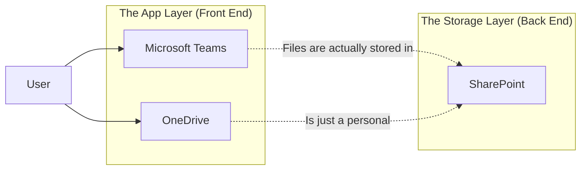

When planning an ERP system (like Business Central, SAP, or Oracle), beginners and consultants often overlook a critical component: **Where do we put the files?**

You might think, *"We'll just put them in the ERP database."*
**Stop.** That is the #1 mistake in enterprise system design. ERP databases are expensive, structured storage for *data* (customers, invoices, ledgers), not *documents* (PDFs, contracts, images).

Enter **SharePoint**.

If your ERP is the "Brain" of your company, SharePoint is the "Digital Office Building". Here is the simplest explanation of what SharePoint actually is, stripped of the confusing Microsoft jargon.

## The Analogy: The Digital Office Building

Imagine your physical office building. It has specific structures that serve specific purposes. SharePoint works exactly the same way.

| Physical Office | SharePoint Component | Purpose |
| :--- | :--- | :--- |
| **The Building** | **Site Collection** | The container for a specific department or project (e.g., HR Building, Finance Building). |
| **The Notice Board** | **Pages** | Where you display news, links, and dashboards for everyone to see. |
| **The Filing Cabinet** | **Document Library** | Where you store files (Word, Excel, PDFs) with folders and tags. |
| **The Ledger / Excel Sheet** | **List** | A database-like table for tracking items (Ticket status, asset inventory) *without* files. |

Or, visualized:

```mermaid
graph TD
    Tenant[Your Company Tenant] --> SiteCol1[HR Site Collection]
    Tenant --> SiteCol2[Finance Site Collection]
    
    SiteCol1 --> Page1[Home Page / Notice Board]
    SiteCol1 --> Lib1[Policies Library (Files)]
    SiteCol1 --> List1[Employee Requests (Data List)]
    
    style Tenant fill:#f9f,stroke:#333,stroke-width:2px
    style SiteCol1 fill:#ccf,stroke:#333,stroke-width:2px
    style SiteCol2 fill:#ccf,stroke:#333,stroke-width:2px
    style Lib1 fill:#efe,stroke:#333,stroke-width:2px
    style List1 fill:#eef,stroke:#333,stroke-width:2px
```

## The 4 Core Builders (The Legos)

SharePoint is made of four basic "Lego bricks". Once you understand these, you can build anything.

### 1. Sites (The Rooms)
A **Site** is just a container. It's like a room in your office.
*   **Team Site**: Think of this as a **Project Room**. It's connected to Microsoft Teams. Only invited members can enter, and everyone collaborates (edits files) together.
*   **Communication Site**: Think of this as the **Lobby or Cafeteria**. It's for broadcasting information (HR News, Company Policies). A few people write, but the whole company reads.

### 2. Lists (The Data)
A **List** is basically "Excel on the Web", but smarter.
*   It has rows and columns.
*   Use it for: Help desk tickets, inventory lists, event sign-ups.
*   **Why not just use Excel?** Because multiple people can edit a List at the same time without locking the file, and you can trigger automation (Power Automate) when a new row is added.

### 3. Libraries (The Files)
A **Library** is a super-charged shared folder.
*   It stores actual files.
*   **Version History**: It automatically keeps backup versions every time you save.
*   **Co-Authoring**: Two people can type in the same Word doc at the same time.
*   **Metadata**: Instead of deeply nested folders (`Finance > 2025 > Jan > Invoices > Approved`), you can tag files (`Type: Invoice`, `Status: Approved`) and filter them instantly.

### 4. Pages (The Dashboard)
A **Page** is the visual web interface. You drag and drop "Web Parts" onto it to display information from your Lists and Libraries.

## Why This Matters for ERP Planning

If you are implementing Business Central or any ERP, you need SharePoint for two reasons:

### Reason 1: It's the "Cheap" Storage
ERP storage costs \$40+/GB. SharePoint storage is often included in your licenses or costs pennies per GB.
*   **Bad Design**: Attaching a 10MB PDF contract directly to a Vendor card in Business Central.
*   **Good Design**: Storing the PDF in SharePoint and Business Central just stores the *link* to it.

### Reason 2: The "Glue" for Automation
SharePoint is the foundation of the Microsoft Power Platform.

*   **Power Automate**: Can watch a SharePoint Library.
    *   *Trigger*: "When a new file is uploaded to the 'Invoices' library..."
    *   *Action*: "...Read the PDF using AI, and create a Purchase Invoice in Business Central automatically."

## The Ecosystem View

SharePoint rarely lives alone. It is the backend for almost everything in M365.



**Key Takeaway**: When you share a file in a Teams chat, you are actually saving it to SharePoint (or OneDrive for Business, which is just a personal SharePoint site).

## Conclusion

Don't be intimidated by SharePoint. It's not a magical black box; it's just a **Digital Office**.
*   **Sites** are your departments.
*   **Libraries** are your filing cabinets.
*   **Lists** are your clipboards.

For any enterprise system, use the ERP for *processing transactions* and SharePoint for *managing content*. That is the foundation of a scalable digital architecture.
