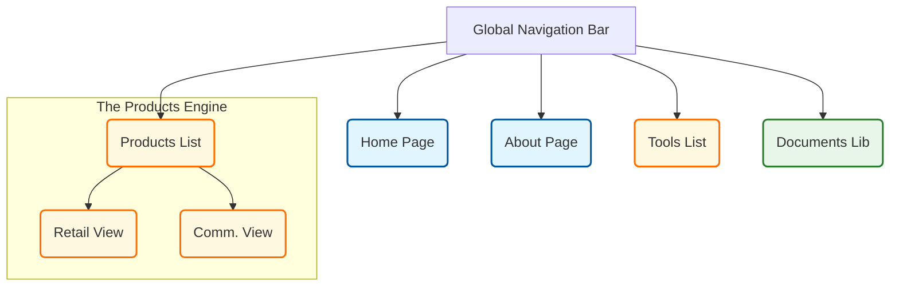

In our [Case Study](), we presented a sitemap for the "Client Bank" intranet. A common question from developers is: *"That looks great, but what **is** it in SharePoint? Is it a Page? A List? A Hub?"*

This guide bridges the gap between the Visual Sitemap and the Technical Implementation.

## The Sitemap: Technical Breakdown

Here is the exact mapping of every node in our design to the physical SharePoint component you need to create.

| Sitemap Node (Menu Item) | SharePoint Component Type | Implementation Details |
| :--- | :--- | :--- |
| **Home Page** | **Site Page (Home.aspx)** | The root `Home.aspx` of your Communication Site. |
| **Client Bank Info** | **Site Page** | A standard page (`/SitePages/About.aspx`) with text web parts. |
| ↳ *Org Chart* | **Image / Web Part** | An embedded Image or the "Organization Chart" web part on the About page. |
| ↳ *Vision & Strategy* | **Site Page** | A child page (`/SitePages/Vision.aspx`). |
| **Products & Services** | **Page + List View** | This is **NOT** a static page. It is a link to a **List View**. |
| ↳ *Retail Banking Search* | **List View URL** | URL: `/Lists/Products/RetailView.aspx`. |
| ↳ *Commercial Banking Search* | **List View URL** | URL: `/Lists/Products/CommercialView.aspx`. |
| **Human Resources** | **Site Page** | A Landing Page (`/SitePages/HR_Home.aspx`) acting as a dashboard. |
| ↳ *Careers* | **External Link** | Link to the public career portal (e.g., `careers.clientbank.com`). |
| ↳ *Leave & Benefits* | **Site Page** | `/SitePages/HR_Benefits.aspx` containing links to PDF policies. |
| ↳ *Digital Onboarding* | **Site Page** | `/SitePages/New_Joiner.aspx` with embedded onboarding videos (Stream). |
| **Tools Portal** | **List View** | A Custom List named "Tools" with a defined View (`/Lists/Tools/AllItems.aspx`). |
| **Resources Library** | **Document Library** | The default "Documents" library (`/Shared Documents`). |
| **News & Events** | **Site Page (News Hub)** | A page (`/SitePages/News.aspx`) with the "News" web part configured to show "All items". |

## Deep Dive: Why These Choices?

### 1. "Products & Services" = List View
**Why not a page?**
If you make a static page, someone has to manually update HTML every time a product changes.
**Technical Choice**: By linking directly to the SharePoint **List View** (`AllItems.aspx` or a custom view), the "page" is auto-generated by SharePoint. When a Commercial Manager changes a product status to "Obsolte" in the list backend, it instantly vanishes from the view.

### 2. "Tools Portal" = Custom List
**Why not a page with links?**
A "Tools" page often becomes a mess of broken hyperlinks.
**Technical Choice**: Create a **Custom List** with columns: `Tool Name`, `URL`, `icon`, `Category`.
*   You use the **Gallery View** (Tile view) formatting to make it look like an App Store.
*   You can set permissions on specific list items if needed (though rare for tools).

### 3. "Resources" = Document Library
**Structure**:
Do NOT create a sub-site for resources. Use the main **Shared Documents** library.
*   **Metadata**: use Columns (`Department`, `DocType`) instead of folders.
*   **Views**: Create Views like "HR Policies", "IT Guides" that filter this single library based on metadata.

## Visual Summary

*   **Blue**: Standard Site Pages (Static Content)
*   **Orange**: Lists & List Views (Dynamic Data)
*   **Green**: Document Libraries (Files)

## Conclusion

The secret to a maintainable SharePoint Intranet is knowing when **NOT** to use a Page.
*   If it's text and telling a story -> **Page**.
*   If it's structured data (Products, Tools) -> **List**.
*   If it's files -> **Library**.
