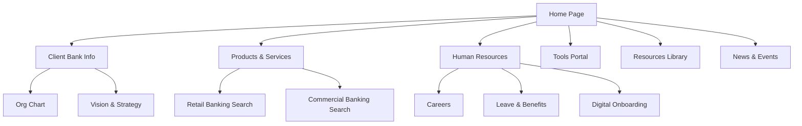
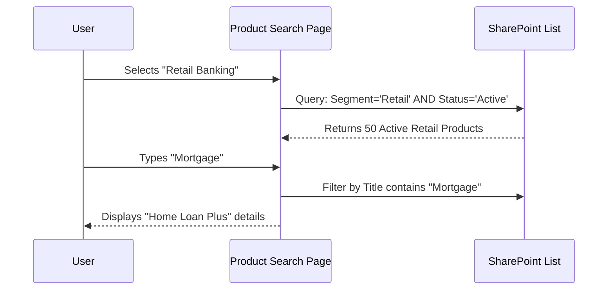

In the previous post, we explored the foundations of SharePoint. Today, we are looking at a real-world application: a design specification for a major bank (referred to here as "Client Bank") aiming to unify its culture through a new Intranet.

The constraint? **No custom code.** The entire solution must be built using native SharePoint Online capabilities.

Here is how we architected the "One Client Bank" portal.

## 1. The Strategic Objective

The goal wasn't just "sharing files." It was to foster a **“One Client Bank” culture**.
Every design decision was made to ensure staff felt:
1.  **Included**: Access to the same news and tools.
2.  **Informed**: Clear "Headlines" vs "Operational" news.
3.  **Aligned**: Easy access to strategy and vision.

## 2. Technical Architecture

The "No-Code" rule forced us to be creative with standard features.

| Requirement | Native Solution |
| :--- | :--- |
| **Publishing Control** | Enabled "Publishing Features" with approval workflows for News and Documents. |
| **Search** | Leveraged SharePoint Native Search with custom **Field Indexing** for product lookups. |
| **News** | Uses standard "News Posts" with metadata tagging (not folders) to categorize stories. |

## 3. Site Structure & Navigation

The architecture follows a clear hierarchy, utilizing a Hub structure (implied) or a robust Site Collection with effectively planned navigation.

### The Sitemap

## 4. Key Functional Modules

### A. The "Smart" Home Page
The landing page isn't static. It relies on dynamic Web Parts filtering content types.
*   **Headline News**: A "Highlighted Content" web part that filters Pages where `Headline = Yes`.
*   **Quick Access**: Icon-based links to key external apps (Core Banking, HRMS).
*   **Suggestion Box**: A simple SharePoint List with a Microsoft Form or List Form web part.

### B. The Products & Services Engine
This is the most complex part of the system. Instead of static HTML pages for each bank product, we designed a **Database-driven approach** using a Custom List.

**The List Structure:**
*   **List Name**: `Products and Services`
*   **Key Columns**:
    *   `Product Name` (Text)
    *   `Customer Segment` (Choice: Retail, Commercial)
    *   `Status` (Choice: Active, Obsolete)
    *   `Training Materials` (Multi-line / Link)

**The User Experience**:
Users don't browse folders. They visit a page with a **List View** filtered by "Retail" or "Commercial". They can search by keyword (e.g., "Student Loan") and instantly see active products.

### C. The HR "Employee Center"
HR content is split into lifecycle stages rather than administrative departments to make it user-friendly.

*   **New Joiner**: Dedicated onboarding pages.
*   **Your Health**: Insurance and medical benefits.
*   **Growth**: Learning & Development.

## 5. Security & Governance

The governance model relies on standard Microsoft 365 Groups and ACLs:
*   **Owners**: IT Admins (Technical control).
*   **Members**: Content Creators (Marketing, HR, Product Owners).
*   **Visitors**: All Staff (Read-only access).

**Data Sources & Responsibility**:
Who owns the files in the "Resources" library? We mapped it clearly:
*   *Laws & Regulation* -> Legal Team
*   *AML Policies* -> Risk & Compliance
*   *Marketing Assets* -> Marketing Team

## Conclusion

This blueprint proves that you don't need expensive 3rd party intranet-in-a-box solutions. With a well-structured **Information Architecture (IA)** and proper use of **Metadata** (Columns instead of Folders), SharePoint Online can serve as a robust, enterprise-grade application platform for banking.
