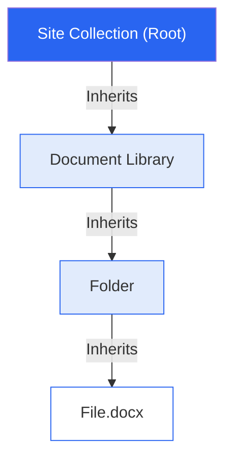
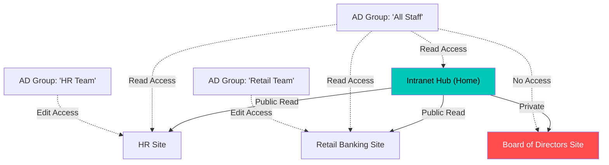

Security is the most critical aspect of any banking intranet. Unlike a startup where everyone sees everything, a bank requires strict information barriers. 

In this guide, we will break down **how SharePoint permissions work** and then **build a practical permission model** for a real-world scenario. We will use **BRED Bank Cambodia** (and its typical structure: Retail, Corporate, HR, Risk) as our design use case.

## Part 1: How SharePoint Actually Manages Permissions

Before designing, you must understand the engine. SharePoint permissions flow top-down like a waterfall.

### 1. The Core Hierarchy (Inheritance)

Everything in SharePoint inherits permissions from its parent by default.

*   **Golden Rule:** **Do not break inheritance** unless absolutely necessary.
*   **The Cost:** Every time you break inheritance (unique permissions), you create a "security island" that is hard to manage and audit later.

### 2. The "Masks" of Access

SharePoint doesn't just have "Read" and "Write". It has granular permission levels:
*   **Full Control**: God mode. Can delete the site. (For IT Admins only).
*   **Edit**: Can add/edit/delete lists and libraries. (For Site Owners).
*   **Contribute**: Can add/edit/delete *items* but not the list itself. (For regular Contributors).
*   **Read**: Can view and download. (For Visitors).
*   **View Only**: Can view but *cannot download* (Great for sensitive policy documents).

### 3. Modern Groups (M365 vs SharePoint)

This is where most people get confused.

| Group Type | Purpose | Best For |
| :--- | :--- | :--- |
| **SharePoint Groups** | Local to the site only. (e.g., "HR Site Visitors") | Fine-grained access control within an intranet. |
| **M365 Groups** | Connected to Teams, Exchange, Planner. | Collaboration projects (e.g., "IT Project Alpha"). |
| **Security Groups** | Synced from Active Directory (AD). | managing broad access (e.g., "All Staff", "Managers"). |

---

## Part 2: Use Case - The "BRED Bank" Model

Let's design a permission model for [bredcambodia.com.kh](https://bredcambodia.com.kh/).
We have three types of content: structures (Public, Departmental, Restricted) and typical Departments (Retail, Corporate, HR).

### The Access Matrix

We will define 3 Tiers of security.

| Tier | Sensitivity | Audience | Example Content | Permission Level |
| :--- | :--- | :--- | :--- | :--- |
| **Tier 1** | **Public** | All Staff | News, Announcements, Canteen Menu | **Read** (All Staff)   **Contribute** (Comms Team) |
| **Tier 2** | **Department** | Function Specific | HR Policies, Retail Product Specs, IT Forms | **Read** (All Staff)   **Edit** (Dept Members) |
| **Tier 3** | **Restricted** | Strictly Private | Board Minutes, Salary Data, Strategy Drafts | **No Access** (Most)   **Edit** (Specific Owners) |

### The "Hub & Spoke" Architecture

In modern SharePoint, we don't create huge subsites. We create **separate Site Collections** and join them to a **Hub**. This keeps permissions clean.

---

## Part 3: Implementation Guide

Here is how you actually configure this in SharePoint Online.

### Step 1: Create Your "Role Groups" in AD
Do **not** add users individually to SharePoint sites.
*   Create an AD Security Group: `SG_BRED_AllStaff` (Dynamic group containing everyone).
*   Create AD Security Groups for depts: `SG_BRED_HR`, `SG_BRED_Retail`, `SG_BRED_IT`.

### Step 2: Configure the Hub (Home Site)
1.  Go to **Site Permissions**.
2.  Set **Site Visitors** = `SG_BRED_AllStaff`. (Everyone can read news).
3.  Set **Site Members** = `Phnom Penh Comms Team`. (Only they can post news).

### Step 3: Configure Department Sites (e.g., HR)
HR is unique. Everyone needs to *read* policies, but only HR can *edit* them. And the "Salaries" folder must be hidden.

**A. The Site Level (Default):**
*   **Visitors**: `SG_BRED_AllStaff`
*   **Members**: `SG_BRED_HR`

**B. The "Policies" Library (Tier 2):**
*   *Inherits permissions from Site.* (No changes needed. Everyone can read, HR can edit).

**C. The "Salary Review" Folder (Tier 3 - Breaking Inheritance):**
1.  Select the Folder -> **Manage Access**.
2.  Click **"Stop Inheriting Permissions"**.
3.  **Remove** `SG_BRED_AllStaff`.
4.  **Remove** `SG_BRED_HR` (if junior HR shouldn't see it).
5.  **Add** `HR Director` and `Comp & Ben Manager` explicitly.

### Common Pitfalls to Avoid

> "I want to hide this document from search."
>
> **Solution:** Permissions control search. If a user doesn't have Read permission, the search result **will not appear** for them. You don't need to configure search settings separately.

> "I want targeted news."
>
> **Solution:** Do not use permissions for this. Use **Audience Targeting**.
> *   **Permissions** = Security (Can I see it?)
> *   **Audience Targeting** = Relevance (Should I see it?)

## Summary

Designing the BRED Bank intranet security model comes down to simplicity:
1.  Use **AD Groups** (`All Staff`, `Departments`), not individual names.
2.  Use **Site Collections** (Hub architecture) to separate "Public" vs "Private" workspaces.
3.  Only **break inheritance** for truly sensitive data (Tier 3).
