<div style="background: linear-gradient(135deg, rgba(0,115,198,0.2), rgba(33,150,243,0.1)); border-left: 4px solid #0073c6; padding: 20px; border-radius: 8px; margin-bottom: 30px;">
<strong style="color: #0073c6;">📋 What We're Building</strong>
<p style="color: #c0c0c0; margin: 10px 0 0 0;">
A WordPress plugin that displays banking products/services from a SharePoint list, with secure iframe embedding and Power Automate synchronization.
</p>
</div>


---

## Architecture Overview

```
┌─────────────────┐     ┌──────────────────┐     ┌─────────────────┐
│   SHAREPOINT    │────▶│  POWER AUTOMATE  │────▶│    WORDPRESS    │
│   (Source)      │     │  (Sync Engine)   │     │   (Display)     │
├─────────────────┤     ├──────────────────┤     ├─────────────────┤
│ • Product List  │     │ • Scheduled Sync │     │ • Custom Plugin │
│ • Categories    │     │ • Webhook Trigger│     │ • REST API      │
│ • Permissions   │     │ • Data Transform │     │ • Shortcodes    │
└─────────────────┘     └──────────────────┘     └─────────────────┘
                                                          │
                                                          ▼
                                                 ┌─────────────────┐
                                                 │  SHAREPOINT     │
                                                 │  (iframe embed) │
                                                 │  Site Owner Only│
                                                 └─────────────────┘
```

---

## Integration Flow Diagram

```mermaid
flowchart TD
    subgraph WEBRED["🏢 WE BRED - SharePoint Site"]
        A[("📋 Products & Services List")] 
        B["👤 Site Owner<br/>(Full Control)"]
        B2["🔧 Can Manage<br/>Power Automate Flow"]
    end

    subgraph Actions["Site Owner Actions"]
        C{"Add/Edit/Delete<br/>Product Item"}
        C2{"Run Manual Sync<br/>(Optional)"}
    end

    subgraph PowerAutomate["⚡ Power Automate<br/>(Owned by Site Owner)"]
        D["🔔 Trigger:<br/>When item is created<br/>or modified in WE BRED"]
        E["🔄 Transform Data:<br/>Map SP columns to<br/>WordPress format"]
        F{"Check Product<br/>Status"}
        G["📤 HTTP POST to<br/>bredcambodia.com.kh/wp-json/sppc/v1/products"]
        H["🗑️ HTTP DELETE from<br/>bredcambodia.com.kh API"]
    end

    subgraph BRED["🌐 bredcambodia.com.kh - WordPress"]
        I["🔐 Security Layer:<br/>Validate API Key<br/>Check IP Whitelist"]
        J{"Request<br/>Valid?"}
        K["✅ Upsert Product<br/>to Database"]
        L["❌ Return 401/403<br/>Unauthorized"]
        M[("💾 wp_sp_products<br/>Database Table")]
    end

    subgraph Display["🔒 Internal Display (NOT PUBLIC)"]
        N["🖼️ Product Catalog<br/>Hidden from Public"]
        O["📄 Product Detail<br/>Internal Only"]
        P["🔍 Search<br/>Restricted Access"]
    end

    subgraph Embed["🔗 WE BRED Intranet Embed"]
        Q["iframe embedded in<br/>WE BRED SharePoint"]
        R["👁️ Site Owners Only<br/>Can View & Manage"]
    end

    B --> B2
    B --> C
    B2 --> C2
    C --> A
    C2 --> D
    A --> D
    D --> E
    E --> F
    F -->|"Status = Active"| G
    F -->|"Status = Inactive<br/>or Deleted"| H
    G --> I
    H --> I
    I --> J
    J -->|"✓ Valid"| K
    J -->|"✗ Invalid"| L
    K --> M
    M --> N
    M --> O
    M --> P
    N --> Q
    Q --> R

    style WEBRED fill:#0078d4,stroke:#005a9e,color:#fff
    style PowerAutomate fill:#8b5cf6,stroke:#6d28d9,color:#fff
    style BRED fill:#21759b,stroke:#1e6091,color:#fff
    style Display fill:#e74c3c,stroke:#c0392b,color:#fff
    style Embed fill:#f59e0b,stroke:#d97706,color:#fff
```

<div style="background: linear-gradient(145deg, #1a1a2e, #16213e); border-radius: 12px; padding: 25px; margin: 25px 0; border-left: 4px solid #0ea5e9;">
<h4 style="color: #0ea5e9; margin-top: 0;">📊 Complete Data Flow: WE BRED (SharePoint) → bredcambodia.com.kh (WordPress)</h4>
<p style="color: #a0a0a0;">When a Site Owner adds or edits a product in the WE BRED SharePoint site, the flow automatically syncs to bredcambodia.com.kh WordPress site.</p>
</div>



### Site Owner Permissions for Automation

<div style="background: linear-gradient(135deg, rgba(46,204,113,0.15), rgba(39,174,96,0.05)); border: 1px solid rgba(46,204,113,0.3); border-radius: 12px; padding: 25px; margin: 25px 0;">
<h4 style="color: #2ecc71; margin-top: 0;">✅ What Site Owners Can Do</h4>
<ul style="color: #c0c0c0;">
<li><strong>Create/Edit/Delete</strong> products in the WE BRED Products & Services list</li>
<li><strong>Own and manage</strong> the Power Automate flow for sync</li>
<li><strong>Run manual sync</strong> to push all products to WordPress</li>
<li><strong>View the embedded catalog</strong> within SharePoint</li>
<li><strong>Monitor sync status</strong> and troubleshoot errors</li>
</ul>
</div>

### Flow Steps Explained

| Step | Component | Description |
|------|-----------|-------------|
| **1** | WE BRED SharePoint | Site Owner adds or modifies a product in the Products & Services list |
| **2** | Power Automate | Trigger detects the change automatically (owned by Site Owner) |
| **3** | Power Automate | Data is transformed to match bredcambodia.com.kh API format |
| **4** | Power Automate | HTTP request sent to bredcambodia.com.kh REST API |
| **5** | bredcambodia.com.kh | Security layer validates API key and IP whitelist |
| **6** | bredcambodia.com.kh | Product data is inserted/updated in WordPress database |
| **7** | bredcambodia.com.kh | Data stored securely (NOT displayed publicly) |
| **8** | WE BRED Intranet | **Only Site Owners** can view catalog via embedded iframe |


## Part 1: WordPress Plugin Structure

### File Structure

```
wp-content/plugins/sp-product-catalog/
├── sp-product-catalog.php      # Main plugin file
├── includes/
│   ├── class-api-handler.php   # REST API endpoints
│   ├── class-security.php      # Security functions
│   └── class-shortcodes.php    # Shortcode handlers
├── assets/
│   ├── css/style.css           # Frontend styles
│   └── js/catalog.js           # Frontend scripts
└── templates/
    ├── product-list.php        # Category listing
    └── product-detail.php      # Single product view
```

### Main Plugin File

```php
<?php
/**
 * Plugin Name: SharePoint Product Catalog
 * Description: Display products from SharePoint with Power Automate sync
 * Version: 1.0.0
 * Author: Your Name
 */

if (!defined('ABSPATH')) exit; // Security: Block direct access

class SP_Product_Catalog {
    
    private static $instance = null;
    
    public static function get_instance() {
        if (null === self::$instance) {
            self::$instance = new self();
        }
        return self::$instance;
    }
    
    private function __construct() {
        $this->define_constants();
        $this->load_dependencies();
        $this->register_hooks();
    }
    
    private function define_constants() {
        define('SPPC_VERSION', '1.0.0');
        define('SPPC_PLUGIN_DIR', plugin_dir_path(__FILE__));
        define('SPPC_PLUGIN_URL', plugin_dir_url(__FILE__));
    }
    
    private function load_dependencies() {
        require_once SPPC_PLUGIN_DIR . 'includes/class-security.php';
        require_once SPPC_PLUGIN_DIR . 'includes/class-api-handler.php';
        require_once SPPC_PLUGIN_DIR . 'includes/class-shortcodes.php';
    }
    
    private function register_hooks() {
        // Activation/Deactivation
        register_activation_hook(__FILE__, [$this, 'activate']);
        register_deactivation_hook(__FILE__, [$this, 'deactivate']);
        
        // Enqueue assets
        add_action('wp_enqueue_scripts', [$this, 'enqueue_assets']);
        
        // Register custom post type for products
        add_action('init', [$this, 'register_product_cpt']);
        
        // Register REST API endpoints
        add_action('rest_api_init', [$this, 'register_api_routes']);
    }
    
    public function activate() {
        $this->register_product_cpt();
        $this->create_database_tables();
        flush_rewrite_rules();
    }
    
    public function register_product_cpt() {
        register_post_type('sp_product', [
            'labels' => [
                'name' => 'SP Products',
                'singular_name' => 'SP Product'
            ],
            'public' => false,  // HIDDEN from public frontend
            'show_ui' => true,  // Visible in WP Admin
            'exclude_from_search' => true,
            'publicly_queryable' => false,
            'supports' => ['title', 'editor', 'custom-fields'],
            'show_in_rest' => true, // Required for Power Automate API
            'menu_icon' => 'dashicons-products'
        ]);
    }
    
    private function create_database_tables() {
        global $wpdb;
        $charset_collate = $wpdb->get_charset_collate();
        
        $sql = "CREATE TABLE IF NOT EXISTS {$wpdb->prefix}sp_products (
            id mediumint(9) NOT NULL AUTO_INCREMENT,
            sp_id varchar(100) NOT NULL,
            title varchar(255) NOT NULL,
            category varchar(100) NOT NULL,
            subcategory varchar(100),
            target_market text,
            features text,
            fees text,
            customer_segment varchar(255),
            requirements text,
            status varchar(50) DEFAULT 'Active',
            start_date date,
            end_date date,
            last_synced datetime DEFAULT CURRENT_TIMESTAMP,
            PRIMARY KEY (id),
            UNIQUE KEY sp_id (sp_id)
        ) $charset_collate;";
        
        require_once(ABSPATH . 'wp-admin/includes/upgrade.php');
        dbDelta($sql);
    }
    
    public function enqueue_assets() {
        wp_enqueue_style('sppc-style', SPPC_PLUGIN_URL . 'assets/css/style.css', [], SPPC_VERSION);
        wp_enqueue_script('sppc-script', SPPC_PLUGIN_URL . 'assets/js/catalog.js', ['jquery'], SPPC_VERSION, true);
        
        wp_localize_script('sppc-script', 'sppcAjax', [
            'ajaxurl' => admin_url('admin-ajax.php'),
            'nonce' => wp_create_nonce('sppc_nonce')
        ]);
    }
}

// Initialize plugin
SP_Product_Catalog::get_instance();
```

---

## Part 2: Security Implementation

<div style="background: linear-gradient(135deg, rgba(231,76,60,0.15), rgba(192,57,43,0.05)); border: 1px solid rgba(231,76,60,0.3); border-radius: 12px; padding: 25px; margin: 25px 0;">
<h4 style="color: #e74c3c; margin-top: 0;">🔒 Security is Critical</h4>
<p style="color: #c0c0c0;">Banking product data requires multiple security layers:</p>
</div>

### Security Class

```php
<?php
// includes/class-security.php

class SPPC_Security {
    
    // API Key for Power Automate authentication
    private static $api_key_option = 'sppc_api_key';
    
    /**
     * Validate API request from Power Automate
     */
    public static function validate_api_request($request) {
        // 1. Check API Key header
        $api_key = $request->get_header('X-SPPC-API-Key');
        $stored_key = get_option(self::$api_key_option);
        
        if (empty($api_key) || !hash_equals($stored_key, $api_key)) {
            return new WP_Error('unauthorized', 'Invalid API Key', ['status' => 401]);
        }
        
        // 2. Validate IP whitelist (optional but recommended)
        $allowed_ips = get_option('sppc_allowed_ips', []);
        $client_ip = self::get_client_ip();
        
        if (!empty($allowed_ips) && !in_array($client_ip, $allowed_ips)) {
            return new WP_Error('forbidden', 'IP not allowed', ['status' => 403]);
        }
        
        // 3. Rate limiting
        if (!self::check_rate_limit($client_ip)) {
            return new WP_Error('rate_limited', 'Too many requests', ['status' => 429]);
        }
        
        return true;
    }
    
    /**
     * Generate secure API key
     */
    public static function generate_api_key() {
        $key = wp_generate_password(64, true, true);
        $hashed = hash('sha256', $key);
        update_option(self::$api_key_option, $hashed);
        return $key; // Return unhashed for Power Automate config
    }
    
    /**
     * Rate limiting implementation
     */
    private static function check_rate_limit($ip, $limit = 100, $window = 3600) {
        $transient_key = 'sppc_rate_' . md5($ip);
        $requests = get_transient($transient_key) ?: 0;
        
        if ($requests >= $limit) {
            return false;
        }
        
        set_transient($transient_key, $requests + 1, $window);
        return true;
    }
    
    /**
     * Sanitize product data from SharePoint
     */
    public static function sanitize_product_data($data) {
        return [
            'sp_id'            => sanitize_text_field($data['sp_id'] ?? ''),
            'title'            => sanitize_text_field($data['title'] ?? ''),
            'category'         => sanitize_text_field($data['category'] ?? ''),
            'subcategory'      => sanitize_text_field($data['subcategory'] ?? ''),
            'target_market'    => wp_kses_post($data['target_market'] ?? ''),
            'features'         => wp_kses_post($data['features'] ?? ''),
            'fees'             => wp_kses_post($data['fees'] ?? ''),
            'customer_segment' => sanitize_text_field($data['customer_segment'] ?? ''),
            'requirements'     => wp_kses_post($data['requirements'] ?? ''),
            'status'           => sanitize_text_field($data['status'] ?? 'Active'),
            'start_date'       => sanitize_text_field($data['start_date'] ?? ''),
            'end_date'         => sanitize_text_field($data['end_date'] ?? ''),
        ];
    }
    
    private static function get_client_ip() {
        $ip_keys = ['HTTP_X_FORWARDED_FOR', 'HTTP_CLIENT_IP', 'REMOTE_ADDR'];
        foreach ($ip_keys as $key) {
            if (!empty($_SERVER[$key])) {
                return sanitize_text_field($_SERVER[$key]);
            }
        }
        return '';
    }
}
```

### Security Best Practices Table

| Layer | Implementation | Purpose |
|-------|---------------|---------|
| **API Authentication** | SHA-256 hashed API key in header | Validate Power Automate requests |
| **IP Whitelisting** | Azure/M365 IP ranges only | Block unauthorized sources |
| **Rate Limiting** | 100 requests/hour per IP | Prevent abuse |
| **Input Sanitization** | WordPress sanitize functions | Prevent XSS/SQL injection |
| **HTTPS Only** | Force SSL on API endpoints | Encrypt data in transit |
| **Nonce Verification** | wp_nonce for frontend AJAX | Prevent CSRF attacks |

---

## Part 3: REST API for Power Automate

```php
<?php
// includes/class-api-handler.php

class SPPC_API_Handler {
    
    public function __construct() {
        add_action('rest_api_init', [$this, 'register_routes']);
    }
    
    public function register_routes() {
        $namespace = 'sppc/v1';
        
        // Endpoint for Power Automate to push products
        register_rest_route($namespace, '/products', [
            'methods' => 'POST',
            'callback' => [$this, 'sync_products'],
            'permission_callback' => [$this, 'check_permission']
        ]);
        
        // Endpoint to sync single product
        register_rest_route($namespace, '/products/(?P<sp_id>[a-zA-Z0-9-]+)', [
            'methods' => ['PUT', 'DELETE'],
            'callback' => [$this, 'update_product'],
            'permission_callback' => [$this, 'check_permission']
        ]);
        
        // Public endpoint for frontend (read-only)
        // NOTE: For internal-only catalogs, restrict this permission callback
        register_rest_route($namespace, '/catalog', [
            'methods' => 'GET',
            'callback' => [$this, 'get_catalog'],
            'permission_callback' => '__return_true' // Change to validate_token() if strict privacy needed
        ]);
    }
    
    public function check_permission($request) {
        return SPPC_Security::validate_api_request($request);
    }
    
    /**
     * Sync products from Power Automate
     */
    public function sync_products($request) {
        global $wpdb;
        $table = $wpdb->prefix . 'sp_products';
        
        $products = $request->get_json_params();
        
        if (!is_array($products)) {
            return new WP_Error('invalid_data', 'Expected array of products', ['status' => 400]);
        }
        
        $synced = 0;
        $errors = [];
        
        foreach ($products as $product) {
            $clean_data = SPPC_Security::sanitize_product_data($product);
            
            // Upsert: Update if exists, insert if new
            $existing = $wpdb->get_var($wpdb->prepare(
                "SELECT id FROM $table WHERE sp_id = %s",
                $clean_data['sp_id']
            ));
            
            $clean_data['last_synced'] = current_time('mysql');
            
            if ($existing) {
                $result = $wpdb->update($table, $clean_data, ['sp_id' => $clean_data['sp_id']]);
            } else {
                $result = $wpdb->insert($table, $clean_data);
            }
            
            if ($result !== false) {
                $synced++;
            } else {
                $errors[] = $clean_data['sp_id'];
            }
        }
        
        return [
            'success' => true,
            'synced' => $synced,
            'errors' => $errors,
            'timestamp' => current_time('c')
        ];
    }
    
    /**
     * Get catalog for frontend display
     */
    public function get_catalog($request) {
        global $wpdb;
        $table = $wpdb->prefix . 'sp_products';
        
        $category = sanitize_text_field($request->get_param('category') ?? '');
        $search = sanitize_text_field($request->get_param('search') ?? '');
        
        $where = "WHERE status = 'Active'";
        $params = [];
        
        if ($category) {
            $where .= " AND category = %s";
            $params[] = $category;
        }
        
        if ($search) {
            $where .= " AND (title LIKE %s OR features LIKE %s)";
            $params[] = '%' . $wpdb->esc_like($search) . '%';
            $params[] = '%' . $wpdb->esc_like($search) . '%';
        }
        
        $query = "SELECT * FROM $table $where ORDER BY category, title";
        
        if (!empty($params)) {
            $query = $wpdb->prepare($query, $params);
        }
        
        $products = $wpdb->get_results($query, ARRAY_A);
        
        // Group by category
        $grouped = [];
        foreach ($products as $product) {
            $cat = $product['category'];
            if (!isset($grouped[$cat])) {
                $grouped[$cat] = [];
            }
            $grouped[$cat][] = $product;
        }
        
        return $grouped;
    }
}

new SPPC_API_Handler();
```

---

## Part 4: Power Automate Flow Setup

<div style="background: linear-gradient(145deg, #1a1a2e, #16213e); border-radius: 12px; padding: 25px; margin: 25px 0; border-left: 4px solid #8b5cf6;">
<h4 style="color: #8b5cf6; margin-top: 0;">⚡ Power Automate Configuration</h4>
</div>

### Flow 1: Scheduled Full Sync

```json
{
  "trigger": {
    "type": "Recurrence",
    "schedule": {
      "frequency": "Hour",
      "interval": 1
    }
  },
  "actions": [
    {
      "name": "Get_SharePoint_Products",
      "type": "SharePoint_GetItems",
      "inputs": {
        "site": "https://webred.sharepoint.com/sites/WEBRED",
        "list": "Products and Services",
        "filter": "Status eq 'Active'"
      }
    },
    {
      "name": "Transform_Data",
      "type": "Select",
      "inputs": {
        "from": "@body('Get_SharePoint_Products')?['value']",
        "select": {
          "sp_id": "@item()?['ID']",
          "title": "@item()?['Title']",
          "category": "@item()?['Category']?['Value']",
          "subcategory": "@item()?['Subcategory']?['Value']",
          "target_market": "@item()?['TargetMarket']",
          "features": "@item()?['ProductFeatures']",
          "fees": "@item()?['FeesAndCharges']",
          "customer_segment": "@item()?['CustomerSegment']",
          "requirements": "@item()?['Requirements']",
          "status": "@item()?['Status']?['Value']",
          "start_date": "@item()?['StartDate']",
          "end_date": "@item()?['EndDate']"
        }
      }
    },
    {
      "name": "Push_To_WordPress",
      "type": "HTTP",
      "inputs": {
        "method": "POST",
        "uri": "https://bredcambodia.com.kh/wp-json/sppc/v1/products",
        "headers": {
          "Content-Type": "application/json",
          "X-SPPC-API-Key": "@parameters('WordPressAPIKey')"
        },
        "body": "@body('Transform_Data')"
      }
    }
  ]
}
```

### Flow 2: Real-time Webhook (On Item Change)

```
Trigger: When an item is created or modified (WE BRED SharePoint)
  ↓
Condition: Status = 'Active' OR Status changed
  ↓
  ├─ Yes → HTTP POST to bredcambodia.com.kh API (single product)
  └─ No  → HTTP DELETE from bredcambodia.com.kh API (remove product)
```

---

## Part 5: Embedding in SharePoint iframe

<div style="background: linear-gradient(135deg, rgba(231,76,60,0.15), rgba(192,57,43,0.05)); border: 1px solid rgba(231,76,60,0.3); border-radius: 12px; padding: 25px; margin: 25px 0;">
<h4 style="color: #e74c3c; margin-top: 0;">🚨 CRITICAL: Regulatory Compliance & Security</h4>
<p style="color: #c0c0c0;">
To comply with bank regulations, the Product Catalog is <strong>strictly blocked from public access</strong>. It employs a "Defense in Depth" strategy:
</p>
<ul style="color: #c0c0c0; margin-bottom: 0;">
<li><strong>CSP Headers:</strong> Browser refuses to load iframe unless parent is <code>webred.sharepoint.com</code></li>
<li><strong>Referrer Check:</strong> Server rejects requests not originating from the intranet</li>
<li><strong>Token Validation:</strong> Access requires a valid, rotating security token</li>
<li><strong>Direct Access Block:</strong> Public users visiting the URL directly get a 403 Forbidden error</li>
</ul>
</div>

### Step 1: WordPress - Strict CSP Headers

```php
// Add to plugin: Strict Security Headers for Bank Compliance
add_action('send_headers', function() {
    // 1. Define the ONLY allowed parent (WE BRED Intranet)
    $allowed_origin = 'https://webred.sharepoint.com'; 
    
    // 2. Send Content-Security-Policy forces browser to block if parent doesn't match
    header("Content-Security-Policy: frame-ancestors 'self' $allowed_origin");
    
    // 3. Legacy protection
    header("X-Frame-Options: ALLOW-FROM $allowed_origin");
    
    // 4. Prevent indexing
    header("X-Robots-Tag: noindex, nofollow");
});

// Create dedicated iframe endpoint (no WP theme wrapper)
add_action('init', function() {
    add_rewrite_rule(
        '^product-catalog-embed/?$',
        'index.php?sppc_embed=1',
        'top'
    );
});

add_filter('query_vars', function($vars) {
    $vars[] = 'sppc_embed';
    return $vars;
});

add_action('template_redirect', function() {
    if (get_query_var('sppc_embed')) {
        include SPPC_PLUGIN_DIR . 'templates/embed-catalog.php';
        exit;
    }
});
```

### Step 2: SharePoint - Embed Web Part Configuration

```html
<!-- SharePoint Modern Page - Embed Web Part -->
<iframe 
    src="https://bredcambodia.com.kh/product-catalog-embed/?token=SECURE_TOKEN"
    width="100%" 
    height="800"
    frameborder="0"
    allow="encrypted-media"
    sandbox="allow-scripts allow-same-origin allow-forms"
    style="border: none; border-radius: 8px;">
</iframe>
```

### Step 3: Server-Side Access Control (Block Public)

```php
add_action('template_redirect', function() {
    // Only apply to our specific embed endpoint
    if (!get_query_var('sppc_embed')) return;
    
    $token = sanitize_text_field($_GET['token'] ?? '');
    $referer = $_SERVER['HTTP_REFERER'] ?? '';
    
    // 1. STRICT REFERER CHECK: Must come from WE BRED SharePoint
    // This blocks direct access (copy-paste URL in new tab)
    if (empty($referer) || strpos($referer, 'webred.sharepoint.com') === false) {
        // Log potential violation for audit trail
        error_log("Security Violation: Attempted direct access from IP " . $_SERVER['REMOTE_ADDR']);
        wp_die('<h1>403 Forbidden</h1><p>Access allowed only via WE BRED Intranet.</p>', 'Access Denied', ['response' => 403]);
    }
    
    // 2. VALIDATE TOKEN: Check encryption token from SharePoint
    if (!SPPC_Security::validate_embed_token($token)) {
        wp_die('<h1>401 Unauthorized</h1><p>Invalid or expired security token.</p>', 'Unauthorized', ['response' => 401]);
    }
});
```

### WE BRED SharePoint Permission Model

```
┌─────────────────────────────────────────────────────────────────┐
│           WE BRED SHAREPOINT PERMISSION FLOW                    │
├─────────────────────────────────────────────────────────────────┤
│                                                                 │
│   WE BRED SharePoint Site                                       │
│   └── Site Owners Group (Full Control)                          │
│       ├── ✓ Can ADD/EDIT/DELETE products in list                │
│       ├── ✓ Can OWN & MANAGE Power Automate flows               │
│       ├── ✓ Can RUN MANUAL SYNC to bredcambodia.com.kh          │
│       ├── ✓ Can VIEW embedded product catalog                   │
│       ├── ✓ Can MONITOR sync status and logs                    │
│       └── ✓ Can CONFIGURE API keys and settings                 │
│                                                                 │
│   └── Site Members Group (Edit)                                 │
│       ├── ✓ Can ADD/EDIT products in list                       │
│       ├── ✗ Cannot manage Power Automate flows                  │
│       ├── ✗ Cannot view embedded catalog (optional)             │
│       └── → Products sync automatically via Site Owner's flow   │
│                                                                 │
│   └── Site Visitors Group (Read)                                │
│       ├── ✗ Cannot edit products                                │
│       └── ✗ No access to embed section                          │
│                                                                 │
└─────────────────────────────────────────────────────────────────┘
```

---

## Part 6: Internal Catalog Display (For Embed Only)

<div style="background: linear-gradient(135deg, rgba(231,76,60,0.15), rgba(192,57,43,0.05)); border: 1px solid rgba(231,76,60,0.3); border-radius: 12px; padding: 25px; margin: 25px 0;">
<h4 style="color: #e74c3c; margin-top: 0;">🚫 Not for Public Pages</h4>
<p style="color: #c0c0c0;">These shortcodes are designed to be used ONLY on the protected embed page. Do not use them on public-facing pages.</p>
</div>

```php
<?php
// includes/class-shortcodes.php

class SPPC_Shortcodes {
    
    public function __construct() {
        add_shortcode('sp_product_catalog', [$this, 'render_catalog']);
        add_shortcode('sp_product_detail', [$this, 'render_detail']);
        add_shortcode('sp_product_search', [$this, 'render_search']);
    }
    
    /**
     * [sp_product_catalog category="Lending"]
     */
    public function render_catalog($atts) {
        $atts = shortcode_atts([
            'category' => '',
            'layout' => 'accordion' // accordion, grid, list
        ], $atts);
        
        global $wpdb;
        $table = $wpdb->prefix . 'sp_products';
        
        $where = "WHERE status = 'Active'";
        if ($atts['category']) {
            $where .= $wpdb->prepare(" AND category = %s", $atts['category']);
        }
        
        $products = $wpdb->get_results(
            "SELECT * FROM $table $where ORDER BY category, title",
            ARRAY_A
        );
        
        ob_start();
        include SPPC_PLUGIN_DIR . 'templates/product-list.php';
        return ob_get_clean();
    }
}

new SPPC_Shortcodes();
```

### Template: Accordion Catalog

```php
<!-- templates/product-list.php -->
<div class="sppc-catalog">
    <div class="sppc-search">
        <input type="text" id="sppc-search-input" 
               placeholder="Type here to get results in seconds...">
    </div>
    
    <div class="sppc-categories">
        <?php
        $grouped = [];
        foreach ($products as $p) {
            $grouped[$p['category']][] = $p;
        }
        
        foreach ($grouped as $category => $items): ?>
        <div class="sppc-category-group">
            <div class="sppc-category-header" data-toggle="collapse">
                <span><?php echo esc_html($category); ?></span>
                <span class="sppc-arrow">▼</span>
            </div>
            <div class="sppc-category-content">
                <ul class="sppc-product-list">
                    <?php foreach ($items as $item): ?>
                    <li class="sppc-product-item">
                        <a href="?product_id=<?php echo esc_attr($item['sp_id']); ?>">
                            <?php echo esc_html($item['title']); ?>
                        </a>
                        <?php if ($item['subcategory']): ?>
                        <ul class="sppc-subcategory">
                            <li><?php echo esc_html($item['subcategory']); ?></li>
                        </ul>
                        <?php endif; ?>
                    </li>
                    <?php endforeach; ?>
                </ul>
            </div>
        </div>
        <?php endforeach; ?>
    </div>
</div>
```

---

## Part 7: CSS Styling

```css
/* assets/css/style.css */

.sppc-catalog {
    font-family: 'Segoe UI', system-ui, sans-serif;
    max-width: 1200px;
    margin: 0 auto;
}

.sppc-search {
    background: linear-gradient(135deg, #0ea5e9, #38bdf8);
    padding: 40px;
    border-radius: 8px;
    margin-bottom: 30px;
}

.sppc-search input {
    width: 100%;
    padding: 15px 20px;
    border: none;
    border-radius: 8px;
    font-size: 16px;
}

.sppc-category-header {
    background: linear-gradient(90deg, #0ea5e9, #38bdf8);
    color: white;
    padding: 15px 20px;
    cursor: pointer;
    display: flex;
    justify-content: space-between;
    border-radius: 4px;
    margin-bottom: 2px;
    font-weight: 600;
}

.sppc-category-content {
    padding: 15px 20px;
    border: 1px solid #e5e7eb;
    border-top: none;
}

.sppc-product-list {
    list-style: none;
    padding: 0;
    margin: 0;
}

.sppc-product-item a {
    color: #0ea5e9;
    text-decoration: none;
}

.sppc-product-item a:hover {
    text-decoration: underline;
}
```

---

## Summary

<div style="display: grid; grid-template-columns: repeat(auto-fit, minmax(250px, 1fr)); gap: 20px; margin: 25px 0;">

<div style="background: linear-gradient(145deg, #1a1a2e, #16213e); border-radius: 12px; padding: 20px; border-top: 3px solid #0ea5e9;">
<h4 style="color: #0ea5e9; margin-top: 0;">✅ WordPress Plugin</h4>
<ul style="color: #a0a0a0; padding-left: 20px; margin: 0;">
<li>Custom post type for products</li>
<li>REST API for Power Automate</li>
<li>Shortcodes for display</li>
</ul>
</div>

<div style="background: linear-gradient(145deg, #1a1a2e, #16213e); border-radius: 12px; padding: 20px; border-top: 3px solid #e74c3c;">
<h4 style="color: #e74c3c; margin-top: 0;">🔒 Security</h4>
<ul style="color: #a0a0a0; padding-left: 20px; margin: 0;">
<li>API key authentication</li>
<li>IP whitelisting</li>
<li>Input sanitization</li>
</ul>
</div>

<div style="background: linear-gradient(145deg, #1a1a2e, #16213e); border-radius: 12px; padding: 20px; border-top: 3px solid #8b5cf6;">
<h4 style="color: #8b5cf6; margin-top: 0;">⚡ Power Automate</h4>
<ul style="color: #a0a0a0; padding-left: 20px; margin: 0;">
<li>Scheduled full sync</li>
<li>Real-time webhooks</li>
<li>Data transformation</li>
</ul>
</div>

<div style="background: linear-gradient(145deg, #1a1a2e, #16213e); border-radius: 12px; padding: 20px; border-top: 3px solid #2ecc71;">
<h4 style="color: #2ecc71; margin-top: 0;">🖼️ iframe Embed</h4>
<ul style="color: #a0a0a0; padding-left: 20px; margin: 0;">
<li>CSP headers configured</li>
<li>Token-based access</li>
<li>Site owner only</li>
</ul>
</div>

</div>

---

<div style="background: linear-gradient(135deg, #1a1a2e, #16213e); border-radius: 12px; padding: 25px; text-align: center; margin-top: 30px;">
<p style="color: #a0a0a0; margin: 0 0 15px 0;">
<em>"The best integrations are invisible to users but powerful for administrators."</em>
</p>
<p style="color: #0ea5e9; font-weight: bold; margin: 0;">
🔗 SharePoint + WordPress + Power Automate = Enterprise-Ready Solution
</p>
</div>
