<div style="background: linear-gradient(135deg, #0f172a, #1e293b); border: 1px solid #334155; border-radius: 12px; padding: 30px; margin-bottom: 40px; box-shadow: 0 10px 30px -10px rgba(0,0,0,0.5);">
    <h2 style="color: #38bdf8; margin-top: 0; font-size: 1.8em; border-bottom: 2px solid #334155; padding-bottom: 15px; margin-bottom: 20px;">
        🏢 Executive Summary
    </h2>
    <p style="color: #cbd5e1; font-size: 1.1em; line-height: 1.7; margin-bottom: 25px;">
        <strong>Business Need:</strong> Marketing requires an autonomous way to manage the Product Catalog using familiar tools (SharePoint/Excel) without IT intervention for every update.
    </p>
    <p style="color: #cbd5e1; font-size: 1.1em; line-height: 1.7; margin-bottom: 25px;">
        <strong>Regulatory Constraint:</strong> This data and the preview capability must remain strictly internal to the bank's secure network.
    </p>
    <div style="display: grid; grid-template-columns: repeat(auto-fit, minmax(200px, 1fr)); gap: 15px;">
        <div style="background: rgba(56, 189, 248, 0.1); border-left: 4px solid #38bdf8; padding: 15px; border-radius: 4px;">
            <strong style="color: #7dd3fc; display: block; margin-bottom: 5px;">Efficiency</strong>
            <span style="color: #94a3b8; font-size: 0.9em;">Updates live in < 60 mins. Zero IT tickets.</span>
        </div>
        <div style="background: rgba(16, 185, 129, 0.1); border-left: 4px solid #34d399; padding: 15px; border-radius: 4px;">
            <strong style="color: #6ee7b7; display: block; margin-bottom: 5px;">Security</strong>
            <span style="color: #94a3b8; font-size: 0.9em;">100% Internal. Blocked from Public Internet.</span>
        </div>
        <div style="background: rgba(139, 92, 246, 0.1); border-left: 4px solid #a78bfa; padding: 15px; border-radius: 4px;">
            <strong style="color: #c4b5fd; display: block; margin-bottom: 5px;">Innovation</strong>
            <span style="color: #94a3b8; font-size: 0.9em;">Leverages existing O365 & Power Automate license.</span>
        </div>
    </div>
</div>

---

## 1. Regulatory Compliance & Security Framework

<div style="background: linear-gradient(135deg, rgba(220, 38, 38, 0.1), rgba(153, 27, 27, 0.05)); border: 1px solid rgba(220, 38, 38, 0.3); border-radius: 12px; padding: 25px; margin: 30px 0;">
    <h3 style="color: #ef4444; margin-top: 0; display: flex; align-items: center;">
        <span style="font-size: 1.2em; margin-right: 10px;">🛡️</span> The "Defense in Depth" Strategy
    </h3>
    <p style="color: #cbd5e1; margin-bottom: 20px;">
        To strictly comply with bank regulations regarding internal data exposure, the proposed system implements four concentric layers of security. This ensures that the Product Catalog on <code>bredcambodia.com.kh</code> is <strong>technically impossible</strong> to access from the public internet.
    </p>
    <ul style="list-style: none; padding: 0; color: #cbd5e1;">
        <li style="margin-bottom: 15px; display: flex; align-items: flex-start;">
            <span style="background: #ef4444; color: white; padding: 2px 8px; border-radius: 4px; font-size: 0.8em; margin-right: 12px; margin-top: 3px;">LAYER 1</span>
            <div>
                <strong style="color: #fca5a5;">Strict CSP & Origin Locking</strong><br>
                <span style="font-size: 0.95em; color: #94a3b8;">The web server sends <code>Content-Security-Policy: frame-ancestors</code> which forces all modern browsers to <strong>block the page load</strong> unless the parent window is <code>demo081225.sharepoint.com</code>.</span>
            </div>
        </li>
        <li style="margin-bottom: 15px; display: flex; align-items: flex-start;">
            <span style="background: #f59e0b; color: white; padding: 2px 8px; border-radius: 4px; font-size: 0.8em; margin-right: 12px; margin-top: 3px;">LAYER 2</span>
            <div>
                <strong style="color: #fcd34d;">Server-Side Referrer Validation</strong><br>
                <span style="font-size: 0.95em; color: #94a3b8;">Any request that does not carry a verifiable <code>Referer</code> header from the WeBred Intranet is immediately rejected with a <code>403 Forbidden</code> status and logged for security audit.</span>
            </div>
        </li>
        <li style="margin-bottom: 15px; display: flex; align-items: flex-start;">
            <span style="background: #34d399; color: white; padding: 2px 8px; border-radius: 4px; font-size: 0.8em; margin-right: 12px; margin-top: 3px;">LAYER 3</span>
            <div>
                <strong style="color: #6ee7b7;">Cryptographic Token Rotation</strong><br>
                <span style="font-size: 0.95em; color: #94a3b8;">The iframe URL requires a rotating security token. Old or guessable URLs will return <code>401 Unauthorized</code>.</span>
            </div>
        </li>
        <li style="display: flex; align-items: flex-start;">
            <span style="background: #6366f1; color: white; padding: 2px 8px; border-radius: 4px; font-size: 0.8em; margin-right: 12px; margin-top: 3px;">LAYER 4</span>
            <div>
                <strong style="color: #a5b4fc;">Public Invisibility</strong><br>
                <span style="font-size: 0.95em; color: #94a3b8;">The underlying "Product" data type is registered as <code>public => false</code>. It creates no permalinks, has no archive pages, and is excluded from all site search results.</span>
            </div>
        </li>
    </ul>
</div>

## 2. Solution Architecture

This diagram illustrates the secure data flow and the isolation of the internal display.

```mermaid
flowchart LR
    %% Areas
    subgraph Office["🏢 Where You Work (Intranet)"]
        direction TB
        Staff["👤 Marketing Staff"]
        List["� Product List<br/>(Excel-like Interface)"]
        View["�️ Secure Catalog View<br/>(Visible only here)"]
    end

    subgraph Automation["⚡ The Automation Engine"]
        direction TB
        Robot["🤖 Power Automate<br/>(Runs Automatically)"]
    end

    subgraph System["� The Secure Vault"]
        direction TB
        Safe["� Encrypted Database"]
        Guard["�️ Security Guard<br/>(Checks Access)"]
    end

    %% Flow Connections
    Staff -->|"1. Updates Product"| List
    List -->|"2. Notifies"| Robot
    Robot -->|"3. Securely Sends"| Guard
    Guard -->|"4. Check: Is it safe?"| Safe
    Safe -->|"5. Shows Data"| View

    %% Styling
    style Office fill:#e0f2fe,stroke:#0ea5e9,color:#0f172a
    style Automation fill:#f3e8ff,stroke:#8b5cf6,color:#0f172a
    style System fill:#ecfdf5,stroke:#10b981,color:#0f172a
    style View fill:#fef3c7,stroke:#f59e0b,stroke-width:2px,color:#0f172a
```


<div style="text-align: center; color: #94a3b8; font-style: italic; margin-top: 10px;">
    Figure 1: Simplified Logic Flow - Marketing updates the list, automation handles the rest, and data stays internal.
</div>

---

## 3. Technical Implementation: The Compliance Plugin

This custom WordPress plugin serves as the secure receiver and rendering engine.

### System Architecture (Technical View)
*For IT & Security Teams:* This diagram details the specific protocols and data flow.

```mermaid
sequenceDiagram
    autonumber
    participant SP as 🏢 SharePoint List
    participant PA as ⚡ Power Automate
    participant FW as 🛡️ WAF / Firewall
    participant WP as 🌐 WordPress API
    participant DB as 📦 Secure DB

    Note over SP, PA: Trigger Phase
    SP->>PA: Item Created/Modified
    activate PA
    PA->>PA: Transform Data (JSON Mapped)
    
    Note over PA, WP: Sync Phase (Encrypted)
    PA->>FW: POST /wp-json/sppc/v1/products
    activate FW
    FW->>FW: Check IP Whitelist
    FW->>WP: Forward Request
    deactivate FW
    
    activate WP
    WP->>WP: Validate API Key (Header)
    WP->>DB: UPSERT (Insert or Update)
    activate DB
    DB-->>WP: Success ID
    deactivate DB
    WP-->>PA: 200 OK Response
    deactivate WP
    deactivate PA

    Note over SP, WP: View Phase (Internal)
    participant User as 👤 Intranet User
    User->>WP: Request Embed URL (via iframe)
    activate WP
    WP->>WP: Check Referrer (Must be WeBred)
    WP-->>User: Render HTML (CSP Headers)
    deactivate WP
```



### A. Strict Access Control Implementation
*This code enforces the regulatory requirement that only WeBred intranet users can view the data.*

```php
add_action('send_headers', function() {
    // COMPLIANCE RULE: Define ONLY allowed parent (WeBred Site)
    $allowed_origin = 'https://demo081225.sharepoint.com'; 
    
    // Force browser to block rendering if parent does not match
    header("Content-Security-Policy: frame-ancestors 'self' $allowed_origin");
    header("X-Frame-Options: ALLOW-FROM $allowed_origin");
    header("X-Robots-Tag: noindex, nofollow"); // Prevent Google indexing
});

add_action('template_redirect', function() {
    if (!get_query_var('sppc_embed')) return;
    
    $referer = $_SERVER['HTTP_REFERER'] ?? '';
    
    // AUDIT LOGGING: Block and log direct access attempts
    if (empty($referer) || strpos($referer, 'demo081225.sharepoint.com') === false) {
        error_log("SECURITY AUDIT: Blocked direct access attempt from " . $_SERVER['REMOTE_ADDR']);
        wp_die(
            '<h1>403 Forbidden</h1><p>Access restricted to BRED Bank Internal Network.</p>', 
            'Access Denied', 
            ['response' => 403]
        );
    }
});
```

### B. Secure Data Storage (Hidden Post Type)
*Ensures product data cannot be queried by the public search or accessed via direct URL guessing.*

```php
    public function register_product_cpt() {
        register_post_type('sp_product', [
            'labels' => ['name' => 'SP Products'],
            'public' => false,              // CRITICAL: Hidden from frontend
            'exclude_from_search' => true,  // CRITICAL: Hidden from search
            'publicly_queryable' => false,  // CRITICAL: No permalinks
            'show_ui' => true,              // Visible only to Admin
            'show_in_rest' => true,         // Open for API Sync
            'capability_type' => 'post'
        ]);
    }
```

### C. API Connectivity (Power Automate Endpoint)
*Allows the SharePoint list to push updates securely.*

```php
    // API Listener for Power Automate
    public function sync_products($request) {
        // 1. Validate API Key (Rotated Quarterly)
        SPPC_Security::validate_api_request($request);
        
        // 2. Process Data
        // ... Upsert logic (Insert/Update) ...
    }
```

---

## 4. Automation & Integration (No-Code Sync)

We utilize the existing Microsoft 365 environment to manage data flow, empowering the Marketing team without requiring ongoing IT support.

### Power Automate Workflow
The flow is owned by the **Site Owner**, ensuring business continuity.

**Trigger:** `When an item is created or modified` (SharePoint List: Products & Services)
**Site Address:** `https://demo081225.sharepoint.com/sites/WeBred`

**Action Logic:**
1.  **Transform**: Map SharePoint columns (Title, Fees, Conditions) to JSON.
2.  **Authenticate**: Add `X-SPPC-API-Key` header.
3.  **Transmit**: Send POST request to `https://bredcambodia.com.kh/wp-json/sppc/v1/products`.

### SharePoint Embedding
To view the result, Site Owners use the **Embed Web Part** on a restricted page.

```html
<iframe 
    src="https://bredcambodia.com.kh/product-catalog-embed/?token=[SECURE_TOKEN]"
    width="100%" 
    height="800px" 
    style="border:none;">
</iframe>
```

---

## 5. Operational Governance & Permissions

This solution aligns with BRED Bank's permission models, ensuring clear separation of duties.

<div style="margin: 20px 0;">
<table style="width: 100%; border-collapse: collapse; color: #cbd5e1;">
    <thead>
        <tr style="background: #1e293b; border-bottom: 2px solid #334155;">
            <th style="padding: 15px; text-align: left;">Role</th>
            <th style="padding: 15px; text-align: left;">Scope</th>
            <th style="padding: 15px; text-align: left;">Capabilities</th>
        </tr>
    </thead>
    <tbody>
        <tr style="border-bottom: 1px solid #334155;">
            <td style="padding: 15px; color: #38bdf8; font-weight: bold;">Site Owner (Marketing)</td>
            <td style="padding: 15px;">WeBred Intranet</td>
            <td style="padding: 15px;">
                ✅ Add/Edit Products<br>
                ✅ View Internal Catalog<br>
                ✅ Manage Automations
            </td>
        </tr>
        <tr style="border-bottom: 1px solid #334155;">
            <td style="padding: 15px; color: #94a3b8;">Site Member</td>
            <td style="padding: 15px;">WeBred Intranet</td>
            <td style="padding: 15px;">
                ✅ Edit Products<br>
                🚫 Cannot Change Automation
            </td>
        </tr>
        <tr style="border-bottom: 1px solid #334155;">
            <td style="padding: 15px; color: #f87171;">Public User</td>
            <td style="padding: 15px;">Internet</td>
            <td style="padding: 15px;">
                🚫 <strong>NO ACCESS</strong><br>
                (Blocked by CSP & IP Filter)
            </td>
        </tr>
    </tbody>
</table>
</div>

---

## 6. Implementation Map: Where Does the Code Live?

This diagram clarifies exactly which platform holds which part of the solution stack.

```mermaid
graph TB
    subgraph SP["🏢 SHAREPOINT (Configuration Only)"]
        direction TB
        SP1["📋 Lists Setup<br/>(Products, Categories)"]
        SP2["📄 Site Page Creation<br/>(For Admin View)"]
        SP3["🔌 Embed Web Part<br/>(Standard O365 Component)"]
        
        SP1 --- SP2
        SP2 --- SP3
        
        style SP fill:#e0f2fe,stroke:#0ea5e9
    end

    subgraph PA["⚡ POWER AUTOMATE (Low-Code Logic)"]
        direction TB
        PA1["🔔 Trigger Logic<br/>(On Create/Modify)"]
        PA2["🔄 JSON Mapping<br/>(Data Transformation)"]
        PA3["🌐 HTTP Connector<br/>(API Request Config)"]
        
        PA1 --> PA2
        PA2 --> PA3
        
        style PA fill:#f3e8ff,stroke:#8b5cf6
    end

    subgraph WP["🌐 WORDPRESS (Custom Code)"]
        direction TB
        WP1["🔧 Plugin (PHP)<br/>(sp-product-catalog.php)"]
        WP2["🎨 Styles (CSS)<br/>(style.css)"]
        WP3["📦 Database (SQL)<br/>(wp_sp_products)"]
        WP4["🛡️ Security (PHP)<br/>(CSP Headers / Auth)"]
        
        WP1 --- WP2
        WP1 --- WP3
        WP1 --- WP4
        
        style WP fill:#0f172a,stroke:#334155,color:#fff
    end
```



### Responsibility Breakdown

| Platform | Type | Responsibility | Est. Effort |
|----------|------|----------------|-------------|
| **SharePoint** | *No-Code* | Create Lists, Columns, and the Admin Page. | ~2 Hours |
| **Power Automate** | *Low-Code* | Configure the Flow, Map Fields, Set API Keys. | ~4 Hours |
| **WordPress** | *Pro-Code* | Install Plugin, Configure PHP Constants, CSS Styling. | ~8 Hours |

    <h3 style="margin-top: 0;">Ready for Deployment</h3>
    <p style="opacity: 0.9; margin-bottom: 20px;">
        This architecture delivers <strong>compliance by design</strong>. It grants Marketing autonomy for content updates while keeping IT in control of security perimeters.
    </p>
    <a href="#" style="background: white; color: #0ea5e9; padding: 12px 25px; border-radius: 25px; text-decoration: none; font-weight: bold; display: inline-block;">Download Implementation Plan</a>
</div>
